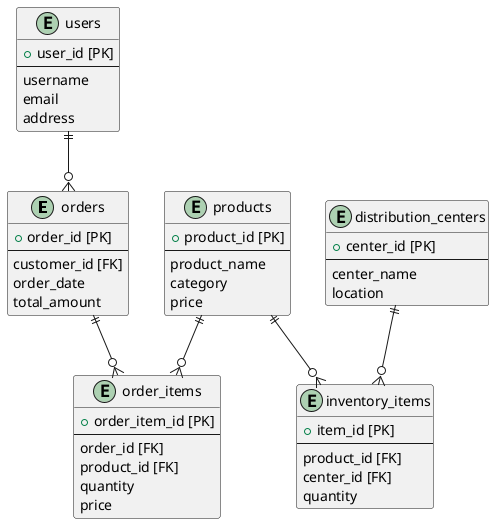

# Defining the source extract data model
In order to understand how the data in the source extracts hangs together, constructing a data model
of the source extract data can often be useful.

A common approach is to define each extract as a table or object, then adding in the `primary keys`
and `foreign keys`` to document the data relationships.
* `primary key`: field or set of fields that uniquely identifies a record in a table
* `foreign key`: field or set of fields that point to records in other tables

In some projects, the data models are defined in purpose built data modelling software, such as ERwin, but
use of specialised data modelling software has reduced dramatically in recent years (probably driven by
the price of software).  The 2 most common practices for recording data models in data marts and warehouses
are as diagrams in either wiki pages, PowerPoint slides, or Visio diagrams.

For capturing the data model of the `thelook` soure extracts, [PlantUML](https://plantuml.com/) mark-down will
be used to create the objects and relationships.  PlantUML enables diagrams to be defined and versions along
with code.  Use of PlantUML isn't as prevalent in organisations, but can is a useful free tool for quickly
defining data models for personal reference or use.

Data models can most often be found using either [Entity Relationship/crows feet](https://plantuml.com/ie-diagram) format or UML format, 
similar to UML class or object models.  Data Engineers that come from more of a data warehousing background tend
towards the ER/crows feet style.  Data Engineers that come from more of a software engineering background
tend to favour the UML class/object style.

Version control services like GitLab can render the PlantUML documents directly in the web UI when included
in markdown documents.  Others like GitHub don't yet render the text into images so mostly useful as 
local reference material.  In VSCode, the PlantUML diagrams can be viewed using the PlanrUML extension.
The diagrams are rendered using the markdown "preview" view.

Being a text/code based tool, quick production of PlantUML diagrams also pairs well with GitHub Copilot
Chat or ChatGPT.  The data model can be describe to Chat and produce the raw PlantUML markdown code.

For example, the following query submitted to GitHub Copilot Chat produces this (first draft model output)[../sample-files/thelook-data-model-md].
This first output isn't correct, can be a time-savings starter.
```
create a PlantUML diagram for a data model using ER notation that includes the following objects
* orders
* order_items
* users
* products
* distribution_centers
* inventory_items
```


The model can be refined using a more details chat request or by using the initial draft output and updating
to produce the intended data model diagram.

## Define a data model for the TheLook source extracts
Define a PlantUML data model for the source extracts in a markdown document that will form part of the 
solution documentation.

Complete the relationship diagram for the remaining objects/tables/extracts in the TheLook source extract.
The data model can be useful for understanding how the data relates together, as well as be useful for
identifying potential data quality issues, such as an `order` having one `user_id` but the `order_item`
has a different `user_id`.  Part of the Data Engineering task is to identify those potential data
issues and define checks to detect issues and possibly define rules on how to handle conflicts automatically
in the pipelines.