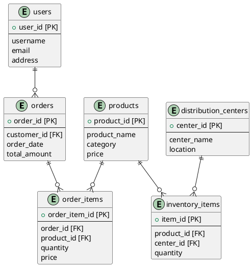
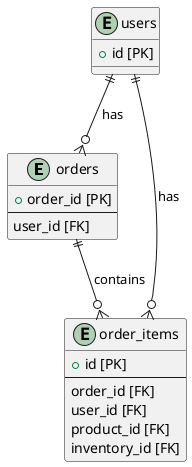

# TheLook source extract data model

The "TheLook" source extract data sets data model.

This model was generating using the Chat prompt
```
create a PlantUML diagram for a data model using ER notation that includes the following objects
* orders
* order_items
* users
* products
* distribution_centers
* inventory_items
```



## Target data model
The target data model created by updating the draft response code above for `orders`, `order_items`, and `users`.
This model focuses on the primary keys [PK] and foreign key [FK] fields and additional attributes are excluded
in order to focus on the overall data relationships.

